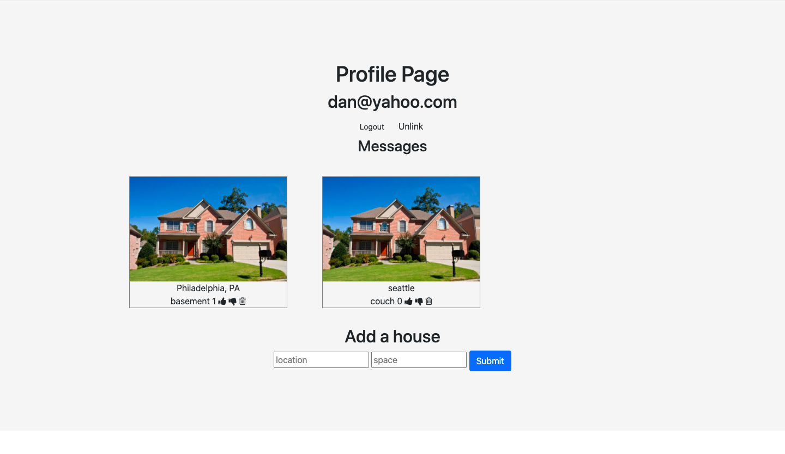

# safe-haven

## Link to Project
https://safe-havre.herokuapp.com/

### Inspiration
There are an estimated 553,742 people in the United States experiencing homelessness on a given night, according to the most recent national point-in-time estimate (January 2017). This represents a rate of approximately 17 people experiencing homelessness per every 10,000 people in the general population.
Safe Haven provides provides a place for homeless people to stay, This will not be the ordinary shelters that you see them in, but rather fellow residents in their neighborhoods that have some extra space in their houses, a couch or some generous apartment buildings that can spare a room.

## How it works
Tech used: EJS, Node.JS, MongoDB & Passport.JS

A user will be able to create an account, enter the desired location, select a desired housing option and get in contact with a host, or even register as a host.
Each housing option will have details of what the housing option eg a couch or a basement.

This app is still under the development process
